# Java Back-end for the Gaming Tournaments Manager Project 

This project implements the backend for my other project, [Gaming Tournament Front](https://github.com/kumo829/GamingTournamentFront), using Java as the main programming language.

For this project I'll use a Clean Architecture, implementing the Hexagonal Architecture and DDD. 

I'll also implement the *Event Sourcing* and *CQRS -Command Query Responsibility Segregation-* desing patterns.  

To provide a general context of this architecture:

# Clean Architecture

Clean Architecture, that is usually explained using this diagram which shows how such an architecture might look on an abstract level:

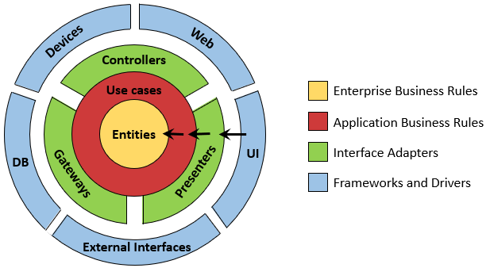

Here, the business rules are testable by design and independent of frameworks, databases, UI technologies, and other external applications or interfaces.

That means that the domain code must not have any outward-facing dependencies. Instead, with the help of the DIP, all dependencies point toward the domain code.

The layers in this architecture are wrapped around each other in concentric circles. The main rule in such an architecture is the dependency rule, which states that all dependencies between those layers must point inward. Basically, the name of something declared in an outer circle must NOT be mentioned by the code in an inner circle. That includes, functions, classes. variables, or any other named software entity.

**We don’t want anything in an outer circle to impact the inner circles**.

The core of the architecture contains the **domain entities**, which are accessed by the surrounding **use cases**. The use cases are what we have called services earlier but are more fine-grained to have a single responsibility (that is, a single reason to change), thus avoiding the problem of broad services.

Around this core, we can find all the other components of our application that support the business rules. This support can mean providing persistence or providing a UI, for example. Also, the outer layers may provide adapters to any other third-party component.

Since the entities (the **domain**) code knows nothing about which persistence or UI framework is used, it cannot contain any code specific to those frameworks and will concentrate on the business rules. This Layer is responsible for the business logic of the application.
It's the most stable layer, and it's basically the heart of the application. We have all the freedom we could wish for to model the domain code. 

Here is where we can apply some Domain-Driven Design tactics, such as Aggregates, Value Objects, Entities, Domain Services, etc. Not having to think about persistence or UI-specific problems makes that so much easier.

As we might expect, clean architecture comes at a cost. Since the domain layer is completely decoupled from the outer layers, such as persistence and UI, we have to maintain a model of our application's entities in each of the layers.

It's important to mention that the Clean Architecture is NOT just a folder structure that you can copy and paste to your project.
It's the idea of separating the application into layers, and conforming to The Dependency Rule, creating a system that is:

- Independent of Frameworks
- Testable
- Independent of UI
- Independent of Database
- Independent of any external agency

	
More information of Hexagonal Architecture

## Hexagonal Architecture (Ports and Adapters Architecture)

The Hexagonal Architecture (also known as Ports and Adapters Architecture) is a software architecture that is based on the idea of isolation of the core business logic from outside concerns by separating the application into loosely coupled components.

It's important to note that Hexagonal Architecture came before Clean Architecture, however, both share the same objective, which is the separation of concerns.

There are different ways to represent it and implement it (as it seems that everyone on the Internet is interpreting it in different ways). The preceding figure shows what a hexagonal architecture might look like.

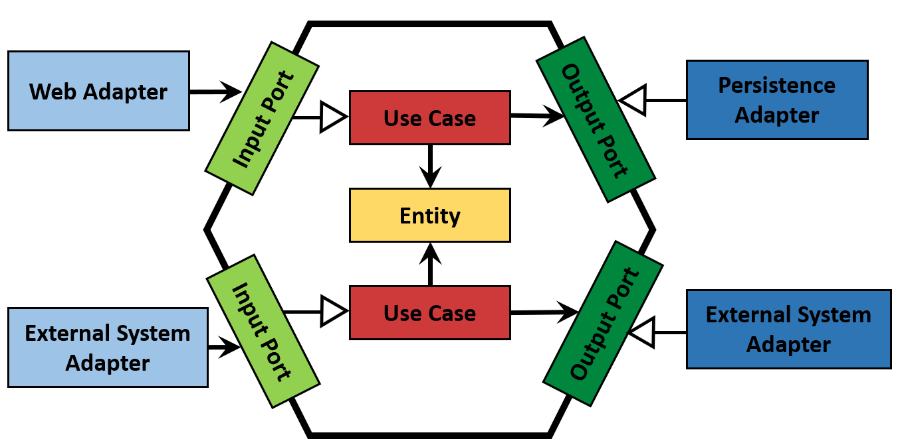

Within the hexagon, we find our **domain entities** and the **use cases** that work with them. Note that the hexagon has no outgoing dependencies, instead all dependencies point toward the center.

Outside of the hexagon, we find various adapters that interact with the application. There might be a web adapter that interacts with a web browser, some adapters interacting with external systems, and an adapter that interacts with a database.

The adapters on the left-hand side are adapters that **drive** our application (because they call our application core) while the adapters on the right-hand side are **driven** by our application (because they are called by our application core).

To allow communication between the application core and the adapters, the application core provides specific **ports**. For driving adapters, such a port might be an interface that is implemented by one of the use case classes in the core and called by the adapter. For a driven adapter, it might be an interface that is implemented by the adapter and called by the core.

That's why sometimes the Hexagonal architecture is represented using this diagram, that combines the entities and use cases in a central element called **Business Logic**, **Domain**, or **Core**.

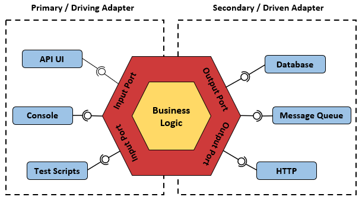

The previous diagram is often simplified in this way, which also helps to integrate the concepts of DDD:

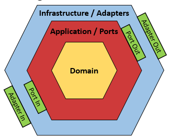

One of the main ideas of the hexagonal architecture is to separate business code from technology code. To achieve these goals, we must determine a place where the business code will exist, isolated and protected from any technology concerns. It'll give rise to the creation of our first hexagon: the **Domain hexagon**.

In the **Domain** hexagon, we assemble the elements responsible for describing the core problems we want our software to solve. **Entities** and **Value objects** are the main elements that are utilized in the Domain hexagon. Entities represent things we can assign an identity to, and value objects are immutable components that we can use to compose our entities. The terms refer to both the entities and value objects that come from DDD principles.

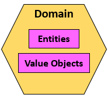

The **Domain** hexagon represents an effort to understand and model a real-world problem.

We also need ways to use, process, and orchestrate the business rules coming from the Domain hexagon. That's what the **Application** hexagon does. It sits between the business and technology sides, serving as a middleman to interact with both parties. The Application hexagon utilizes **ports** and **use cases** to perform its functions.

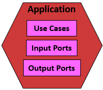

The **Infrastructure** (sometimes also called **Framework**) hexagon provides the outside world interface. That's the place where we have the opportunity to determine how to expose application features – this is where we define REST or gRPC endpoints, for example. And to consume things from external sources, we use the Infrastructure hexagon to specify the mechanisms to fetch data from databases, message brokers, or any other system. In the hexagonal architecture, we materialize technology decisions through **adapters**.

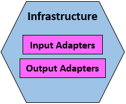

The input adapters from the Framework hexagon don't need to depend on the input port implementations from the Application hexagon. Instead, the input adapters will only depend on the use case interface types, rather than the input ports concrete types. In such a context, we can regard input adapters as high-level components and input port as low-level components. Input adapters refer to use case interfaces.

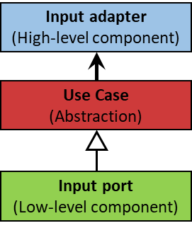

On the other hand, input ports depend on output ports. In that sense, input ports can be regarded as high-level components because they depend on the abstractions provided by output ports. Output adapters act as low-level components that provide implementations for output port abstractions. The following diagram shows an illustration of this dependency inversion arrangement:

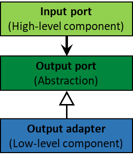

Using the first diagrams, we could represent out graphically represent our components in this way: 

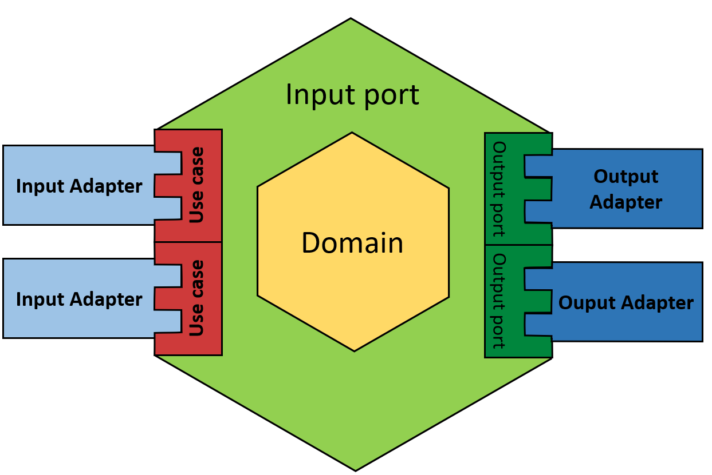

## Implementation
Each module (microservice) will be implemented using the following package structure, which combines the concepts of hexagonal architecture and Domain-Driven Design. I'm trying to not make it complex, but flexible to modify it when necessary:

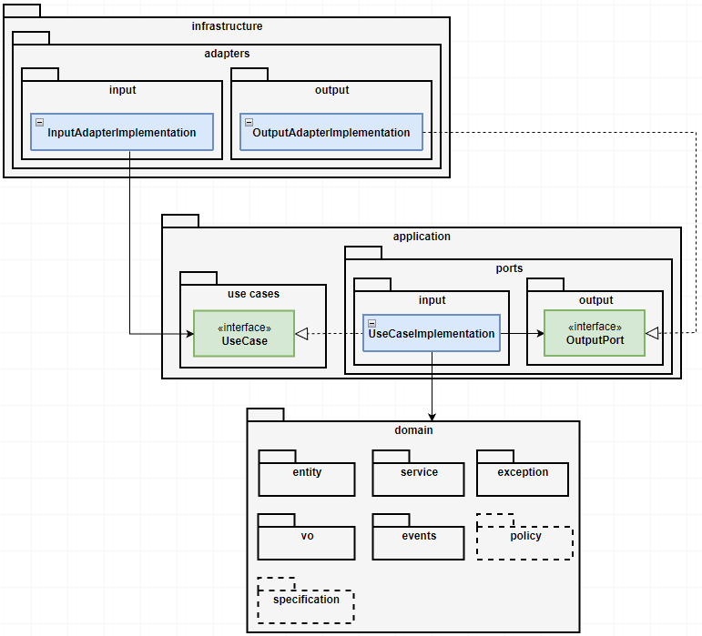

The main packages -`domain`, `application`, and `infrastructure`(framework)- resemble the hexagonal architecture's layers. The subpackages, I think that the names are self-explanatory. 

# CQRS

CQRS is a software design pattern that suggest that the applications should be divided in a *Command* and *Query* parts.

**Commands** alter the state of a resource or entity, and **Queries** returns the state of a resource or entity. With this separation we can scale up the commands and queries sides independently, optimizing each for high performance.

**Commands** are named with a **verb in the imperative mood**, for example `RegisterUserCommand` or `DepositFundsCommand`.

**Events** are objects that **describe something that has occurred** in the application. Events are named with a **past-participle verb**, for example `UserRegisteredEvent` or `FundsDepositedEvent`.

We could think that Command will be receiving by one API, and Queries by another API.

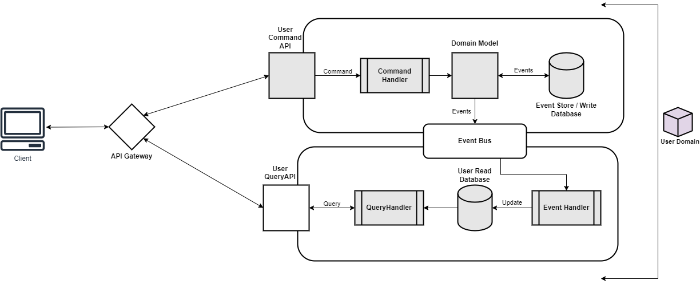

# Event Sourcing 

Defines an approach where all the changes that are made to a resource or entity, are stored as a sequence of immutable events to an event store, as opposite to storing just the current state. We can selectively query these events and reconstruct the state of the application at any point in time.

This opens up the possibility to replay events selectively, replay some events in reverse, and much more. As a consequence, we can treat the application state itself as a secondary citizen, with **the event log as our primary source of truth**.

It is commonly used with the CQRS pattern to perform the data management tasks in response to events and by materializing views from the stored events.

# Tech Stack
Even though I'll try to use different techniques and styles on each "microservice", all of them will share some basic libraries.

| Tool / Framework                                                                                                                        | Version | Use                                                                      | References |
|-----------------------------------------------------------------------------------------------------------------------------------------|-------|--------------------------------------------------------------------------|------------|
|       Java    | 18    | Main programming language                                                |            |
|       Project Lombok       | 1.18.24      | Annotation-based Java library that allows you to reduce boilerplate code |            |
|  Java Bean Validations              | 3.0.2      | Library to express constraints on object models via annotations          |            |
|  Gradle    | 7.5   | Build automation tool                                                    |  https://docs.gradle.org/current/userguide/structuring_software_products.html |
|  Docker | 20.10 | To run the microservices as containers                                   |

## Modules

- [User Management](./src/user-management/) 

## References
- https://codesoapbox.dev/ports-adapters-aka-hexagonal-architecture-explained/
- https://github.com/springdoc/springdoc-openapi-demos/tree/master/springdoc-openapi-spring-boot-2-webmvc
- https://dev.to/peholmst/series/12780
- https://dev.to/kirekov/spring-data-power-of-domain-events-2okm