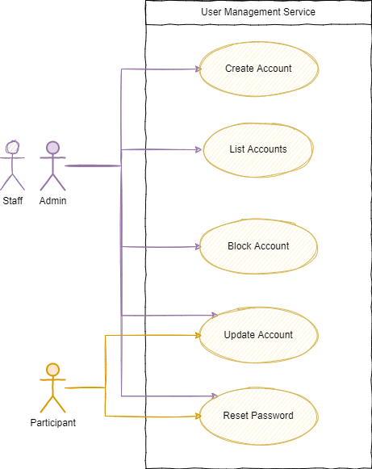
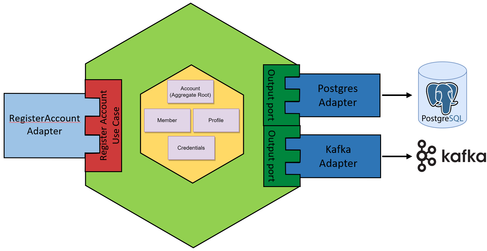
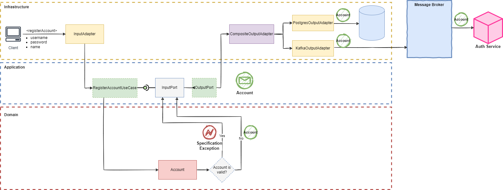

# User Management Service

This service is in charge of everything related to user creation and updates. It implements the following use-cases:

As I'm trying to implement the Hexagonal architecture "by-the-book", the components of the service are arranged in the following structure:

This is an example of the flow that a request to the `RegisterAccountUseCase` follows:

## Development Strategy

For the implementation of this module, I'm putting all the *layers* of the Hexagonal Architecture inside one single project, using **one package per layer**.

### Benefits of this approach

- I don't have to manage different Gradle projects and configurations; this is a all-in-one approach, so I have only one `build.gradle` file.

### Drawbacks of this approach

- In the end, the idea of having all-in-one single project ended creating more problems that benefits. As I started implemented the **Domain** and **Application** hexagons which basically depends on a few third-party libraries, the separation and usage of these dependencies was easy. But as soon as I added the **Infrastructure** hexagon everything became a nighmare, as I'm using several dependencies and modules from *Spring*. And the "temptation" of using some of those functionalities in the inner layers was huge (as they were already there). For the next service I'll use a project-per-layer approach.
- I wanted to depend only on interfaces for the *Spring Validator* on the *Domain* Hexagon, giving the *Infrastructure* the ability to provide the desired implementation. But, as I have to provide an implementation when adding the *Infrastructure* layer, at the end all the effort to only depend on interfaces (or APIs) seems to be broken.

# Tech Stack

| Tool / Framework                                                                                                                                                                                                                                 | Version | Use                                                                    | References |
|--------------------------------------------------------------------------------------------------------------------------------------------------------------------------------------------------------------------------------------------------|---------|------------------------------------------------------------------------|------------|
| <figure style="margin: 0" align="center"><figcaption>Spring Boot</figcaption></figure>                              | 3.0.1   | Main Development Framework                                             | https://docs.spring.io/spring-boot/docs/3.0.1/reference/htmlsingle/ |
| <figure style="margin: 0" align="center"><figcaption>Spring Data JPA</figcaption></figure>                      | 3.0.0   | Repository support for the Jakarta Persistence API (JPA)               | https://docs.spring.io/spring-data/jpa/docs/3.0.0/reference/html/  |
| <figure style="margin: 0" align="center"><figcaption>Spring for Apache Kafka</figcaption></figure> | 3.0.1   | Development of Kafka-based messaging solutions                         | https://docs.spring.io/spring-kafka/reference/html/  |
| <figure style="margin: 0" align="center"><figcaption>REST-Assured</figcaption></figure>                                                                                                              | 5.3.0   | Simple tool for REST services validation                               | https://github.com/rest-assured/rest-assured/wiki/Spring#spring-mock-mvc-module  |
| <figure style="margin: 0" align="center"><figcaption>Hamcrest</figcaption></figure>                                                                                                                      | 2.2     | Matchers that can be combined to create flexible expressions of intent | http://hamcrest.org/JavaHamcrest/javadoc/2.2/org/hamcrest/Matchers.html  |
| <figure style="margin: 0" align="center"><figcaption>Cucumber</figcaption></figure>                                                                                                                      | 7.10.1  | BDD Framework                                                          | https://cucumber.io/docs/cucumber/  |
| <figure style="margin: 0" align="center"><figcaption>Test Contaniers</figcaption></figure>                                                                                                        | 1.17.6  | Lightweight containers for integration tests for databases and servers | https://www.testcontainers.org/  |
| <figure style="margin: 0" align="center"><figcaption>PostgreSQL</figcaption></figure>                                                                                                                  | 15.1    | Production database                                                    | https://www.postgresql.org/docs/  |
| <figure style="margin: 0" align="center"><figcaption>H2</figcaption></figure>                                                                                                                                  | 2.1     | In-Memory Test Database                                                | https://www.h2database.com|